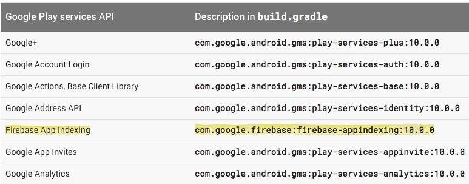

# Firebase

## 前言

Firebase 成立於 2011 年，主要提供 BaaS 的服務，當時的競爭對手有非常戲劇化落幕的 Parse 等。
Firebase 於 2014 年加入了 Google 旗下，繼續他的 BaaS 服務，不過在 2016 Google IO 大會上，Google 給予了新的生命 - 幫助開發者可以 **更容易的開發，成長以及賺錢**。

下圖為 Firebase 的新藍圖，由許多服務結合而成，可以看到 BaaS 變成其中的一部分

好，大家或許會好奇，這些服務現在都有現成的，而且大部分 Google Service Api 也都有提供，他為何要造一樣的輪子？我們真的有必要去使用它嗎？

先告訴大家，有，而且 Google 給了一個無法拒絕的 Offer

上圖可以看到 App Indexing 已經交給 Firebase 來處理了，假如想要使用最新的 Google Play Service API，Firebase 是避不了的！

當然除了上述理由外，Firebase 最重要的是提供許多實用的功能來幫助 App 成長茁壯，而且所有模組都圍繞在最核心的功能：Analytics，
用數字來幫助我們決策，不再只是一昧的去猜想修改程式，讓數字來說話吧！

PS1. 本篇文章會專注在介紹 Firebase 為我們開發上帶來什麼好處，假如想了解 Firebase 如何導入，建議直接上官網了解！

PS2. 因為不是每樣功能都有使用，所以會先針對目前使用的服務做分享

## Cloud Messaging & Notifications
// TODO
## Crash Reporting
// TODO
## Remote Config
// TODO
## App Indexing
// TODO
## Dynamic Links
// TODO
## Invites
// TODO
